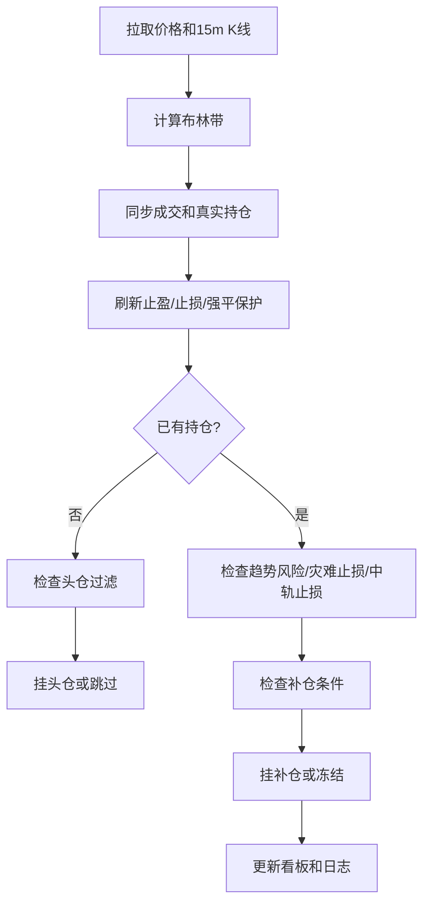

# Bollinger Adaptive Reversion Strategy (BARS)

<p align="center">
  
</p>

BARS is a local OKX futures strategy for `ETH-USDT-SWAP`. It trades Bollinger-band mean reversion with staged entries, dynamic add-ons, fixed-risk exits, capital-locking, dashboard review, and log-based parameter optimization.

This repository is for research and personal automation only. Futures trading with leverage can lose money quickly. Review every parameter before live use.

## English

### What It Does

- Reads OKX 15-minute candles and calculates Bollinger bands locally.
- Logs market snapshots every `PRICE_LOG_INTERVAL` seconds and runs strategy decisions every `POLL_INTERVAL` seconds.
- Enters when price breaks the Bollinger boundary and passes width, trend, and disaster filters.
- Adds to a position only when the new price improves the average entry and the risk guards allow it.
- Places take-profit and stop orders after position sync.
- Rebalances capital after realized PnL unless rolling compound mode is enabled.
- Provides a local dashboard at `http://localhost:8080`.
- Runs offline log replay and parameter optimization with `optimize_report.bat`.

### Project Layout

```text
C:\okx
├── main.py                         # Live strategy entry point
├── start.bat                       # Start live strategy
├── optimize_report.bat             # Run log parameter optimizer
├── README.md
├── assets\                         # Logo and favicon assets
├── src\
│   ├── config.py                   # Main parameter control panel
│   ├── strategy.py                 # BARS live strategy
│   ├── okx_client.py               # OKX REST client wrapper
│   ├── dashboard.py                # Local dashboard server
│   ├── logger.py                   # Terminal and file logging
│   ├── notifier.py                 # ServerChan notifications
│   └── state_store.py              # Runtime state persistence
├── backtest\
│   └── log_parameter_optimizer.py  # Log replay and parameter optimization
└── logs\ / logs_cleaned\           # Runtime logs used for replay
```

Temporary research outputs, downloaded data, cache files, IDE files, secrets, and local logs should stay out of GitHub.

### Setup

1. Create `.env` in the project root:

```env
OKX_API_KEY=your_key
OKX_SECRET_KEY=your_secret
OKX_PASSPHRASE=your_passphrase
OKX_FLAG=1
SERVERCHAN_KEY=your_serverchan_send_key
```

2. Install dependencies in the existing virtual environment or create one:

```powershell
python -m venv .venv
.\.venv\Scripts\pip install -r requirements.txt
```

3. Start the strategy:

```powershell
.\start.bat
```

4. Open the dashboard:

```text
http://localhost:8080
```

### ServerChan Key

`SERVERCHAN_KEY` is used for WeChat notifications.

1. Open [ServerChan](https://sct.ftqq.com/).
2. Log in with WeChat.
3. Copy your `SendKey`.
4. Put it into `.env` as `SERVERCHAN_KEY=...`.

The strategy sends notifications for program-driven entries, add-ons, closes, capital shortage/restoration, liquidation warnings, and trend-risk alerts.

### Runtime Rhythm

```python
PRICE_LOG_INTERVAL = 1
POLL_INTERVAL = 3
BAR_15M = "15m"
BOLL_PERIOD = 20
BOLL_STD = 2.0
BOLL_INCLUDE_CURRENT = True
```

Price and Bollinger snapshots can be logged at 1-second precision, while order decisions still run every 3 seconds by default. Bollinger bands are computed from OKX candles, not directly returned by OKX as Bollinger values.

### Entry Logic

A first batch is considered only when:

- There is no active position or working plan.
- Price breaks below the lower band for long, or above the upper band for short.
- Bollinger width passes the minimum-width rule.
- First-batch Bollinger width is not too wide.
- Entry disaster score does not block the signal.
- The current candle has not already created a plan.
- The price is not still making a fresh extreme according to the no-new-extreme rule.

Important entry parameters:

```python
MIN_BOLL_WIDTH_USD = 15
MIN_BOLL_WIDTH_PCT = 0.015
MIN_BOLL_WIDTH_FLOOR_USD = 10.0
ENTRY_MAX_BOLL_WIDTH_FILTER_ENABLED = True
ENTRY_MAX_BOLL_WIDTH_PCT = 0.028
ENTRY_MAX_BOLL_WIDTH_USD = 80.0
ENTRY_DISASTER_FILTER_ENABLED = True
ENTRY_DISASTER_SCORE_THRESHOLD = 4
NO_NEW_EXTREME_TICKS = 2
REPRICE_GAP_USD = 0.5
```

The effective minimum Bollinger width is calculated by the live strategy from the configured width rules. `BOLL_WIDTH_TP_SPACE_ENABLED` is currently available but disabled by default.

### Add-on Logic

Add-ons are considered only after a real position exists. The strategy checks:

- No pending entry order is still working.
- The current 15-minute candle has not already added a batch.
- Bollinger width is wide enough but does not violate optional add-on max-width rules.
- Trend-risk freeze has not blocked add-ons.
- The new candidate price is far enough from the last real fill price.
- The completed-candle extreme guard allows the add-on.
- The add-on improves the target take-profit position enough.
- Total margin stays below `MAX_TOTAL_ENTRY_RATIO`.
- Fixed-loss stop remains far enough from the first entry.

Sizing is dynamic:

```python
FIRST_BATCH_RATIO = 0.1
SECOND_BATCH_DYNAMIC_BASE_RATIO = 0.14
SECOND_BATCH_DYNAMIC_MIN_RATIO = 0.05
SECOND_BATCH_DYNAMIC_MAX_RATIO = 0.18
SECOND_BATCH_DYNAMIC_FULL_GAP_USD = 10.0
DYNAMIC_BASE_ENTRY_RATIO = 0.08
DYNAMIC_MIN_ENTRY_RATIO = 0.05
DYNAMIC_MAX_ENTRY_RATIO = 0.15
MAX_TOTAL_ENTRY_RATIO = 0.8
MAX_ENTRY_BATCHES = 12
```

The first add-on is now dynamic too. Later add-ons use the later dynamic ratio band. Legacy fixed-batch fields remain in `config.py` only for compatibility.

### Take Profit

Default take-profit is margin-return based:

```python
TP_TARGET_MARGIN_RETURN = 0.28
```

Approximate price distance:

```text
average entry price * TP_TARGET_MARGIN_RETURN / LEVER
```

Dynamic take-profit can lock profit before the default target:

```python
DYNAMIC_TP_ENABLED = True
DYNAMIC_TP_ARM_RETURN = 0.22
DYNAMIC_TP_RESTORE_RETURN = 0.18
DYNAMIC_TP_REPRICE_GAP_USD = 0.5
```

If floating profit reaches the arm threshold and price stops making favorable extremes, the strategy can reprice the take-profit order near the current price. If profit falls below the restore threshold, it restores the normal target.

### Stop Loss And Risk Guards

Current stop and risk modules:

- Liquidation guard stop: keeps a conditional stop near the real liquidation price.
- Fixed-loss stop: places a stop based on strategy risk equity and `COPY_FIXED_LOSS_STOP_RATIO`.
- Fixed-loss head buffer: blocks add-ons if the fixed-loss stop would move too close to the first entry.
- Disaster stop: closes the current position when head adverse move and loss ratio both hit the configured threshold, then keeps the program running.
- Bollinger-mid cost stop: market-closes when Bollinger midline crosses the position cost.
- Trend risk guard: scores trend deterioration, sends alerts, and can freeze add-ons; market close is disabled by default.

Key parameters:

```python
COPY_FIXED_LOSS_STOP_ENABLED = True
COPY_FIXED_LOSS_STOP_RATIO = 0.95
FIXED_LOSS_HEAD_BUFFER_ENABLED = True
FIXED_LOSS_HEAD_BUFFER_PCT = 0.05
DISASTER_STOP_ENABLED = True
DISASTER_HEAD_DROP_PCT = 0.05
DISASTER_LOSS_RATIO = 0.7
BOLL_MID_COST_STOP_ENABLED = True
TREND_RISK_GUARD_ENABLED = True
TREND_RISK_GUARD_CLOSE_ENABLED = False
TREND_RISK_FREEZE_ADDON_ENABLED = True
TREND_RISK_SCORE_THRESHOLD = 5
```

### Capital Modes

Default fixed-capital mode:

```python
TRADING_ACCOUNT_TARGET = 50
ROLLING_COMPOUND_ENABLED = False
```
In this mode, entries and add-ons size from `TRADING_ACCOUNT_TARGET`. After a realized profit, the strategy transfers the realized profit from trading to funding. After a realized loss, it attempts to refill the trading account. If capital is insufficient, it pauses new entries but continues logging market data.

Rolling compound mode:

```python
ROLLING_COMPOUND_ENABLED = True
```

In rolling mode, realized profit stays in the trading account. Entry sizing, add-on sizing, fixed-loss stop, and disaster-stop risk use live effective equity instead of the fixed target.

Cross-copy protection can be combined with either mode:

```python
CROSS_COPY_PROTECT_ENABLED = False
CROSS_COPY_PROTECT_EQUITY_USDT = 500.0
CROSS_COPY_DYNAMIC_SIZING_ENABLED = False
```

When protection is enabled, the protected equity is reserved. Rolling mode uses:

```text
effective equity = account equity - CROSS_COPY_PROTECT_EQUITY_USDT
```

### Dashboard

The local dashboard shows:

- Live price and Bollinger state.
- Runtime strategy state.
- Historical log files.
- Daily trades and realized profit from logs.
- Chart markers for first entry, add-ons, exits, and risk events.

The dashboard is local-only by default and runs from the strategy process.

### Log Optimizer

Run:

```powershell
.\optimize_report.bat
```

The optimizer replays local logs with live-like sizing and current risk guards. It uses a slim core parameter set:

- `FIRST_BATCH_RATIO`
- `MAX_TOTAL_ENTRY_RATIO`
- `MIN_ENTRY_GAP_USD`
- `MIN_BOLL_WIDTH_PCT`
- `ENTRY_MAX_BOLL_WIDTH_PCT`
- `ENTRY_DISASTER_SCORE_THRESHOLD`
- `SECOND_BATCH_DYNAMIC_*`
- `DYNAMIC_*_RATIO`
- `TP_TARGET_MARGIN_RETURN`
- `DYNAMIC_TP_ARM_RETURN`
- `DYNAMIC_TP_RESTORE_RETURN`
- `BOLL_MID_COST_STOP_ENABLED`

The report compares the current config with optimized candidates and includes PnL, drawdown, liquidation buffer, wipeout flags, trades, and signal counts. It is a log replay, not an order-book fill simulator.

## 中文

### 项目简介

BARS 是一个运行在本地的 OKX ETH 永续合约布林带均值回归策略。它的核心不是固定马丁，而是“布林破轨入场 + 动态分批 + 风险过滤 + 固本/滚仓资金管理”。

当前策略重点：

- 用 OKX 15m K 线本地计算布林带。
- 行情可 1 秒记录，策略默认 3 秒判断一次。
- 头仓只在破轨且通过布林宽度、趋势和灾难过滤后挂单。
- 补仓按真实成交价、动态间距、动态比例和风险守卫执行。
- 止盈按保证金收益率计算，支持动态锁盈。
- 止损包含固定亏损条件单、强平保护、灾难止损、布林中轨成本止损、趋势风险冻结补仓。
- 平仓后可选择固本划转，或开启滚仓让利润留在交易账户。
- 本地网页看板展示行情、日志、交易点位和收益。
- 优化器只优化核心收益/风险参数。

### 快速启动

1. 在项目根目录创建 `.env`：

```env
OKX_API_KEY=你的OKX_KEY
OKX_SECRET_KEY=你的OKX_SECRET
OKX_PASSPHRASE=你的OKX密码短语
OKX_FLAG=1
SERVERCHAN_KEY=你的ServerChan_SendKey
```

2. 安装依赖：

```powershell
python -m venv .venv
.\.venv\Scripts\pip install -r requirements.txt
```

3. 启动策略：

```powershell
.\start.bat
```

4. 打开看板：

```text
http://localhost:8080
```

### ServerChan 获取方法

`SERVERCHAN_KEY` 用于微信推送。

1. 打开 [ServerChan](https://sct.ftqq.com/)。
2. 用微信登录。
3. 复制页面里的 `SendKey`。
4. 写入 `.env`：

```env
SERVERCHAN_KEY=你的SendKey
```

程序调用的开仓、补仓、平仓、资金不足、资金恢复、强平预警、趋势风险提醒都会走推送。

### 策略主流程



### 开头仓规则

头仓不是单纯“碰到上下轨就进”。它会依次检查：

- 是否无持仓、无工作计划。
- 当前价格是否破下轨或上轨。
- 布林带最小宽度是否满足。
- 头仓最大布林宽度是否未超限。
- 入场灾难评分是否未拦截。
- 当前 K 线是否已经挂过计划。
- 价格是否还在继续创新低/新高。

常用参数：

```python
MIN_BOLL_WIDTH_PCT = 0.015
ENTRY_MAX_BOLL_WIDTH_PCT = 0.028
ENTRY_DISASTER_SCORE_THRESHOLD = 4
NO_NEW_EXTREME_TICKS = 2
REPRICE_GAP_USD = 0.5
```

### 补仓规则

补仓会比头仓更严格。它要求：

- 已有真实持仓。
- 没有未成交的补仓挂单。
- 本根 15m K 线还没补过仓。
- 距离上一批真实成交价满足有效补仓间距。
- 已完成 K 线极值守卫允许补仓。
- 补仓后止盈价有明显改善。
- 总入场保证金不超过上限。
- 固定亏损止损仍距离头仓足够远。
- 趋势风险没有冻结补仓。

第一次补仓也已改成动态比例：

```python
SECOND_BATCH_DYNAMIC_BASE_RATIO = 0.14
SECOND_BATCH_DYNAMIC_MIN_RATIO = 0.05
SECOND_BATCH_DYNAMIC_MAX_RATIO = 0.18
SECOND_BATCH_DYNAMIC_FULL_GAP_USD = 10.0
```

第 3 批及之后：

```python
DYNAMIC_BASE_ENTRY_RATIO = 0.08
DYNAMIC_MIN_ENTRY_RATIO = 0.05
DYNAMIC_MAX_ENTRY_RATIO = 0.15
```

### 止盈规则

当前默认止盈不是固定 10U，而是保证金收益率：

```python
TP_TARGET_MARGIN_RETURN = 0.28
```

50 倍杠杆下，28% 保证金收益大约对应 0.56% 的价格波动。

动态锁盈：

```python
DYNAMIC_TP_ENABLED = True
DYNAMIC_TP_ARM_RETURN = 0.22
DYNAMIC_TP_RESTORE_RETURN = 0.18
DYNAMIC_TP_REPRICE_GAP_USD = 0.5
```

意思是浮盈达到 22% 后开始观察。如果价格不再继续向有利方向创新高/低，就尝试把止盈单改到实时价格附近；如果收益回落到 18% 以下，就恢复普通止盈目标。

### 止损和风险守卫

当前程序中的止损/风控手段：

- 固定亏损条件止损：按策略风险资金乘以 `COPY_FIXED_LOSS_STOP_RATIO` 计算。
- 强平线保护：根据 OKX 同步的真实强平价更新条件止损。
- 固定止损头仓缓冲：如果补仓会让止损太接近头仓，就跳过。
- 灾难止损：头仓逆向达到阈值且浮亏达到比例时，平掉当前仓位并继续运行。
- 布林中轨成本止损：多单中轨跌到成本、空单中轨涨到成本时平仓。
- 趋势风险守卫：默认只提醒并冻结补仓，不直接市价平仓。

关键参数：

```python
COPY_FIXED_LOSS_STOP_RATIO = 0.95
FIXED_LOSS_HEAD_BUFFER_PCT = 0.05
DISASTER_HEAD_DROP_PCT = 0.05
DISASTER_LOSS_RATIO = 0.7
BOLL_MID_COST_STOP_ENABLED = True
TREND_RISK_GUARD_ENABLED = True
TREND_RISK_GUARD_CLOSE_ENABLED = False
TREND_RISK_FREEZE_ADDON_ENABLED = True
TREND_RISK_SCORE_THRESHOLD = 5
```

### 固本、滚仓和带单保护

默认固本模式：

```python
TRADING_ACCOUNT_TARGET = 50
ROLLING_COMPOUND_ENABLED = False
```

盈利后，实际已实现盈利会从交易账户划转到资金账户；亏损后会尝试从资金账户补回目标资金。资金不足时，程序不会新开仓，但仍会持续记录价格和布林带。

滚仓模式：

```python
ROLLING_COMPOUND_ENABLED = True
```

开启后盈利不划走，交易账户利润继续参与下一轮开仓、补仓、固定止损和灾难止损计算。

带单保护：

```python
CROSS_COPY_PROTECT_ENABLED = False
CROSS_COPY_PROTECT_EQUITY_USDT = 500.0
CROSS_COPY_DYNAMIC_SIZING_ENABLED = False
```

开启后会保留一部分账户权益作为保护资金。若同时开启滚仓，有效策略资金为：

```text
账户总权益 - CROSS_COPY_PROTECT_EQUITY_USDT
```

### 本地看板

看板会读取实时状态和历史 log，用于查看：

- 当前价格、布林带、持仓和权益。
- 单日开仓、补仓、平仓记录。
- 实际收益。
- 图表上的头仓、补仓、平仓和风险事件标记。

### 优化器

运行：

```powershell
.\optimize_report.bat
```

优化器会读取本地 log，按当前策略逻辑做离线回放。当前只接入核心参数，避免网格过大：

```text
FIRST_BATCH_RATIO
MAX_TOTAL_ENTRY_RATIO
MIN_ENTRY_GAP_USD
MIN_BOLL_WIDTH_PCT
ENTRY_MAX_BOLL_WIDTH_PCT
ENTRY_DISASTER_SCORE_THRESHOLD
SECOND_BATCH_DYNAMIC_*
DYNAMIC_*_RATIO
TP_TARGET_MARGIN_RETURN
DYNAMIC_TP_ARM_RETURN
DYNAMIC_TP_RESTORE_RETURN
BOLL_MID_COST_STOP_ENABLED
```

报告会输出收益、回撤、最小强平缓冲、是否 wipeout、交易次数和信号次数。它适合做参数方向判断，但不是订单簿级别的成交模拟。

### GitHub 注意事项

建议提交：

- `src/`
- `backtest/log_parameter_optimizer.py`
- `README.md`
- `start.bat`
- `optimize_report.bat`
- `assets/`

不要提交：

- `.env`
- `.idea/`
- `logs/`
- `logs_cleaned/`
- `backtest/.cache/`
- 下载的历史行情数据
- 极端行情模拟输出
- 临时 tunnel/log 文件

### Current Core Defaults

```python
INST_ID = "ETH-USDT-SWAP"
LEVER = 50
PRICE_LOG_INTERVAL = 1
POLL_INTERVAL = 3
TRADING_ACCOUNT_TARGET = 50
FIRST_BATCH_RATIO = 0.1
MAX_TOTAL_ENTRY_RATIO = 0.8
MIN_ENTRY_GAP_USD = 6
MIN_BOLL_WIDTH_PCT = 0.015
ENTRY_MAX_BOLL_WIDTH_PCT = 0.028
ENTRY_DISASTER_SCORE_THRESHOLD = 4
TP_TARGET_MARGIN_RETURN = 0.28
DYNAMIC_TP_ARM_RETURN = 0.22
DYNAMIC_TP_RESTORE_RETURN = 0.18
ROLLING_COMPOUND_ENABLED = False
```
